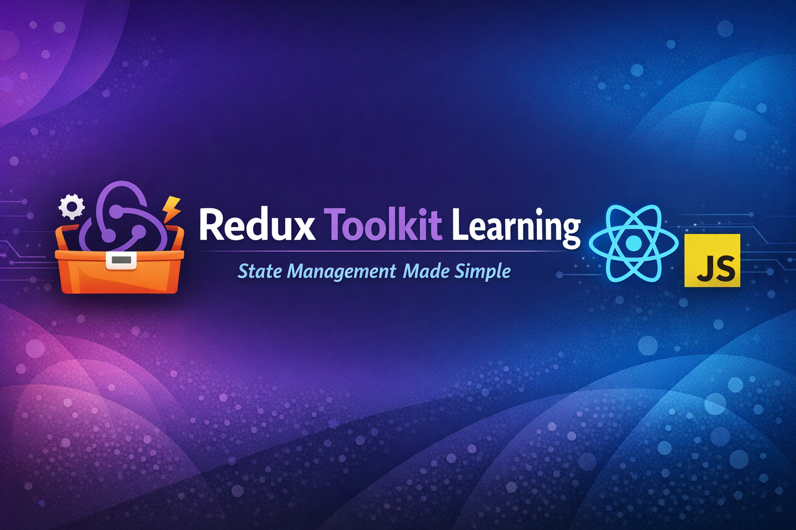

# Redux Toolkit Learning Repository 🚀

This repository is created to learn and practice **Redux** and **Redux Toolkit** in a simple and structured way.  
It covers core Redux concepts with practical examples, especially for React applications.

---

## 📌 What is Redux?
Redux is a **state management library** used to manage and centralize application state in a predictable way, especially for large React applications.

---

## 🛠️ Tech Stack
- React
- Redux
- Redux Toolkit
- JavaScript (ES6+)

---

## 📂 Folder Structure

---

## 🔑 Key Concepts Covered
- Redux Store
- createSlice
- Reducers
- Actions
- useSelector
- useDispatch
- Immutable State Updates
- Modular folder structure

▶️ How to Run the Project

1.Clone the repository
git clone https://github.com/your-username/redux-learning.git

2.Install dependencies
npm install

3.Start the app
npm run dev

